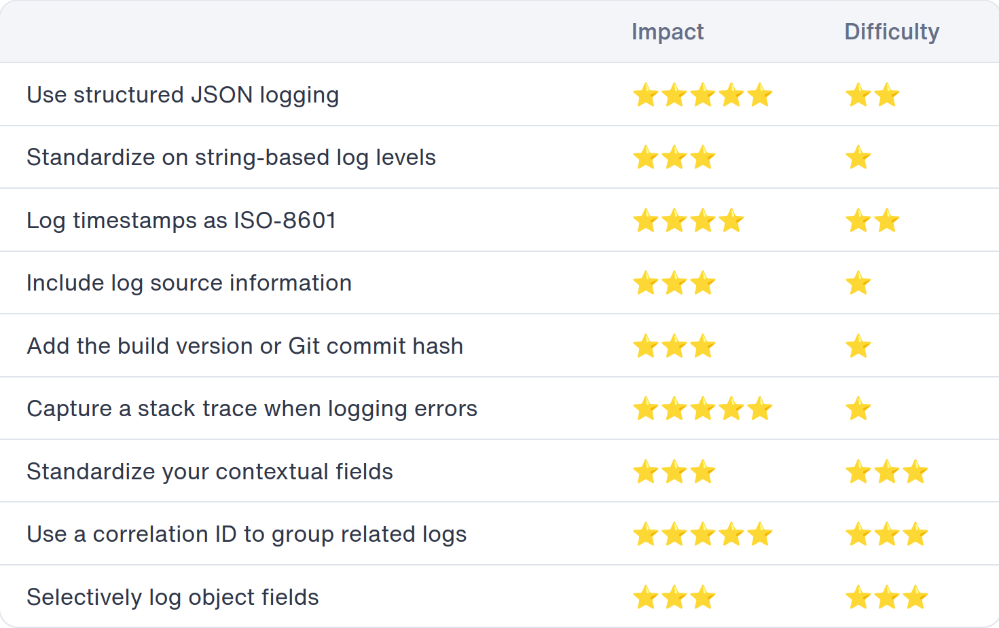

# Projektovanje i implementacije sistema za prikupljanje i analizu sistemskih logova baziranog na Loki platformi

## Zadatak

- [x] Upoznati se sa formatima, nacinom cuvanja i predstavljanja logova
- [ ] Prouciti Loki platformu za prikupljanje sistemskih logova i mogucnosti integracije u ELK stek
  - [ ] Posebno sagledati mogucnosti integracije Logstash i Loki platforme
- [ ] Projektovati arhitekturu sistema baziranog na ELK steku i Loki platformi za prikupljanje i bezbednosnu analizu sistemskih logova
- [ ] Implementirati aplikaciju za analizu logova
  - [ ] Aplikaciju implementirati tako da podatke cita sa Loki platforme i ima mogucnost vizuelizacije rezultata u Grafani
  - [ ] Koristiti kontejnerizovane servise
- [ ] Testirati implementirano resenje

## Zamisao

1. Kreiraj parsere/generatore logova za fajlove koje si skinuo sa Grafane - mozes u Python-u, Node.js-u, mozes i da probas Golang.
2. Nauci kako da shippujes logove u Loki pomocu Logstash-a - generatore logova treba da scrape-ujes i saljes to u Loki;
3. Osmisli statisticku/trend analizu logova - aplikacija cita iz Lokja, analizira i salje u Elasticsearch/nazad u Loki;
4. Profilisanje Lokija i aplikacije pomocu Prometheus-a (opciono);

- Dakle, redosled:
  - Mini applikacije koje sluze kao parseri i 'emiteri' logova - da bi model postao streaming u odnosu na batched;
  - Logstash - sve o tome kako radi i kako prima, filtrira/modifikuje i salje logove dalje - pipeline;
  - Loki - ingestovanje i deployment modovi;
    - U zavisnosti od deployment moda, moze da se uslozni faza testiranja resenja;
  - Bazicna vizuelizacija u Grafani;
  - Aplikacija za (?) analizu - Loki source, Loki/Elasticsearch destination;
  - Vizuelizacija u Grafani bazirana na tipu analize;

## Razrada

### Formati, cuvanje, predstavljanje

- [x] Formati - standardni formati logova (kako/gde se generisu);
- [ ] Cuvanje (i prikupljanje) - nacini za agregaciju i efikasno cuvanje logova;
- [ ] Predstavljanje (vizuelizacija) logova;

#### Formati logova

##### [Log Formats – a (Mostly) Complete Guide](https://graylog.org/post/log-formats-a-complete-guide/)

- Logs tipically fall into category of unstructured text data - difficult to query any useful info;
- Log format is a structured format that allows logs to be machine-readable and easily parsed;

- Syslog server - server that recieves messages related to events from network devices, usually using the syslog protocol;
  - good stuff - centralized system, supported by a lot of equipement natively (everything that runs using an Unix/Linux based OS), and most can be upgraded to send event data in this format;
  - bad stuff - doesn't include message content formatting standard (you can put anything in the message payload), just solves a problem of transportation; not completely reliable; security problems - no auth;

> [!NOTE]  
> Trebalo bi detaljnije da obradis date formate - moze da bude uvod u celu pricu.

- Other formats:
  - JSON format - field-rich databases;
  - Windows Event Log;
  - CEF (Common Event Format);
  - NCSA Common Log Format;
  - ELF (Extended Log Format) - similar to CEF;
  - W3C;

> [!IMPORTANT]
> Moras da opises i formate **Apache**, **Snort** i **NetFlow** logova.

- Dodatak:
  - [Using Trend Analysis for Better Insights](https://graylog.org/post/using-trend-analysis-for-better-insights/);
  - [Must-Have Features for Your Log Management Software](https://graylog.org/post/must-have-features-for-your-log-management-software/);

##### [6 common log-formats](https://www.crowdstrike.com/en-us/cybersecurity-101/next-gen-siem/log-file-formats/)

- Ingestion, parsing, storing - main concerns;
- Desireable features - search, analyzing, correlation, finding trends, alerts (triggers), visualization (dashboards), ...;

- Log format specifies:
  - structured/semi-structured/unstructured;
  - text/binary;
  - type of encoding;
  - delimiting;

##### [Log Formatting in Production: 9 Best Practices](https://betterstack.com/community/guides/logging/log-formatting/)

- Types of log formats:
  - Structured - contemporary and highly effective, with consistent format;
    - facilitates automated searching, analysis and monitoring using log management tools;
    - most widely embraced format is JSON;
    - reduced human-readability;
  - Semi-Structured - have some contextual info, but lack recognizable format;
  - Unstructured - raw text data; `sed`, `awk`, `grep` for filtering, but no sustainable solution;

- Log formatting best practices:
  1. Use structured JSON logging - adopting a framework, or configuring 3rd party apps;
  2. Standardize on string based log levels;
  3. Record timestamps as ISO-8601 (RFC 3339);
  4. Include detailed log source information;
  5. Include build version/commit hash;
  6. Ensure stack traces are included in error logs;
  7. Standardize your contextual fields;
  8. Correlate your request logs with an ID;
  9. Selectively log object fields;

- Dodatak:
  - [How to View and Configure Apache Access and Error Logs](https://betterstack.com/community/guides/logging/how-to-view-and-configure-apache-access-and-error-logs/);
  - [The Top 6 Log Shippers and How to Choose One](https://betterstack.com/community/guides/logging/log-shippers-explained/);
  - [Filebeat vs Logstash: How to Choose in 2024](https://betterstack.com/community/logging/filebeat-vs-logstash/);
  - [Logging Framework](https://betterstack.com/community/guides/logging/logging-framework/);
  - [Log Levels Explained](https://betterstack.com/community/guides/logging/log-levels-explained/);
  - [Safeguarding Sensitive Data when Logging](https://betterstack.com/community/guides/logging/sensitive-data/);
  - [Logging Best Practices - 12 Do's and Dont's](https://betterstack.com/community/guides/logging/logging-best-practices/) - don't rely on logs for monitoring (not suitable for trend analysis and anomaly detection);
  - [Log Management for Beginners](https://betterstack.com/community/guides/logging/log-management/);
  - [Log Aggregation](https://betterstack.com/community/guides/logging/log-aggregation/);
  - [How to Collect Logs with Logstash](https://betterstack.com/community/guides/logging/logstash-explained/);

##### Kompilacija svega procitanog - Formati logova

- struktuirani, polu-struktuirani, nestruktuirani logovi;
- Standardi za formatiranje logova:
  - syslog;
  - JSON;
  - JSON;
  - Windows Event Log;
  - CEF (Common Event Format);
  - NCSA Common Log Format;
  - ELF (Extended Log Format) - similar to CEF;
  - W3C;

> [!CAUTION]
> TODO - Apache, Netflow, Snort logovi.

- Najbolje prakse za generisanje; sta je pozeljno da format logova sadrzi;

#### Cuvanje logova

- [Log Management - Beginners Guide](https://betterstack.com/community/guides/logging/log-management/) - malo sira prica, daje ovom ispod kontekst;
- [Log Management](https://graylog.org/post/what-is-log-management-a-complete-logging-guide/) - kompletna prica;
- [What is Log Aggregation](https://betterstack.com/community/guides/logging/log-aggregation/) - sustina;
- [Log Retention](https://consultdts.com/article/nist-800-171-log-retention/) - suplementarno citanje;

### Loki, Logstash

#### Loki

- General:
  - cost effective;
  - highly scalable;
  - doesn't index contents (making full-text search indexes), but rather indexes metadata - set of labels, that form basis for a **log-stream**;
  - pull instead of push;
  - log-stream is a set of logs with same labels - quality set of labels is key to efficient query execution;
  - stored in **chunks** in an object store (Amazon S3, GCS, filesystem, ...);
    - small index + highly compressed chunks == cost-efficiency;
  - features
    - scalability => can scale from raspberry pi to ingesting petabytes a day; few deployment modes, native microservices with kubernetes;
    - multi-tenant => requests and data between tenants is completely isolated;
    - third-party integrations => has a lot of plugins;
    - efficient storage => labels and chunks, mentioned earlier;
    - LogQL => similar to PromQL, flexible, can generate metrics from logs;
    - alerting => has a component called ruler;
    - integrates with Grafana ecosystem (Grafana, Tempo, Mimir, ...);

#### Ideja

- Python "odasiljac" logova skinutih sa servera;
- Logstash ingester;
- Logovi se salju u ECS i Loki;
  - Kako da se salju u ECS?
    - kako da ih obradim da bi ih efikasno spremio za cuvanje i query;
  - Kako da se salju u Loki?
    - kako da ih obradim da bi ih efikasno spremio za cuvanje i query;
- Obrada citanjem iz Lokija
- Izvestaji (batch obrada, recimo na kraju dana...) - Airflow;
- Realtime obrada sa Spark;

## Literatura

- Knjige:
  1. [Logging and Log Management](https://www.amazon.com/Logging-Log-Management-Authoritative-Understanding/dp/1597496359/ref=as_li_ss_tl?ie=UTF8&linkCode=sl1&tag=solutionsre04-20&linkId=98e5ad60200d86a0e18caf8e69e1a28e) [ ]
  2. [Understanding Log Analytics at Scale](https://www.oreilly.com/library/view/understanding-log-analytics/9781098104269/) [ ]
  3. [Smart Log Data Analytics](https://www.amazon.com/Smart-Log-Data-Analytics-Techniques/dp/3030744523) [ ]
  4. [Security Information and Event Management (SIEM) Implementation](https://www.amazon.com/Security-Information-Management-Implementation-Network/dp/0071701095/ref=as_li_ss_tl?s=books&ie=UTF8&qid=1442846013&sr=1-1&keywords=security+information+and+event+management&linkCode=sl1&tag=solutionsre04-20&linkId=66961f320d0ec4ab49b748362219dfeb) [ ]
  5. [Security Metrics A Beginners Guide](https://www.amazon.com/Security-Metrics-Beginners-Guide-Caroline/dp/0071744002/ref=as_li_ss_tl?s=books&ie=UTF8&qid=1444137396&sr=1-11&keywords=security+information+and+event+management&linkCode=sl1&tag=solutionsre04-20&linkId=20f9888ff19c5cb4415e0c62e7a20d55) [ ]
  6. [Data, Driven Security: Analysis, Visualization and Dashboards](https://www.amazon.com/Data-Driven-Security-Analysis-Visualization-Dashboards/dp/1118793722/ref=as_li_ss_tl?s=books&ie=UTF8&qid=1442851032&sr=1-3&keywords=SIEM&linkCode=sl1&tag=solutionsre04-20&linkId=fcccfdc5576db9f439df1969fcfd77d6) [ ]
  7. [Network Security Through Data Analysis: Building Situational Awareness](https://www.amazon.com/Network-Security-Through-Data-Analysis/dp/1449357903/ref=as_li_ss_tl?s=books&ie=UTF8&qid=1442860785&sr=1-5&keywords=siem&linkCode=sl1&tag=solutionsre04-20&linkId=9c97c58539771d28d0933e2c21934d39) [ ]
  8. [NIST - Guide to Computer Security, Log Management](https://nvlpubs.nist.gov/nistpubs/Legacy/SP/nistspecialpublication800-92.pdf) [x]

- Dodatne knjige
  1. [The Art of Monitoring](https://artofmonitoring.com/) [x]
     - Ima fin teoretski uvod o monitoringu, sa nekim sistematizacijama;
     - Ima kompletan primer implementiranog sistema;
     - Tehnologije - Riemann, Graphite, Grafana, Logstash, Elasticsearch, Kibana, ...
  2. [Observability Engineering](https://info.honeycomb.io/observability-engineering-oreilly-book-2022) [x]
     - Puno teoretskog i apstraktnog o svemu - biblija za observability teoriju, ulazi cak i u neke kulturoloske aspekte;
     - Zanimljivosti o telemetry pipeline-ima;
  3. [The Future of Observability with OpenTelemetry](https://www.oreilly.com/library/view/the-future-of/9781098118433/) [x]
     - O OTel-u, instrumentaciji;
     - Nista specijalno, ako ne radis sa OTel-om;
  4. [Software Telemetry - reliable logging and monitoring](https://www.manning.com/books/software-telemetry) [x]
     - Jako dobar uvod, sadrži objašnjenja o SIEM-u (i neke fine statističke informacije);
     - VRLO DOBRO - SIEM Splunk primer - da li ovo može da bude ideja?
     - konzumiranje telemetrije od strane različitih timova;
     - **Displaying telemetry in centralized logging systems**;
     - zanimljive stvari o regexima ("at scale");
     - kardinalnost;
       - cardinality in logging databases;
     - Elastic vs Loki?
       - what Elasticsearch is good at;
       - what Loki is good at;
  5. [The Fundamentals of Telemetry Pipelines](https://www.oreilly.com/library/view/the-fundamentals-of/9781098153878/) [x]
     - Nista specijalno, vise kao pricica;
  6. [Data Analytics at Scale](https://www.oreilly.com/library/view/data-management-at/9781492054771/) [ ]
  7. [Fundamentals of Data Visualization](https://www.oreilly.com/library/view/fundamentals-of-data/9781492031079/) [ ]

- Naucni radovi:
  1. [Toward the Observability of Cloud-Native Applications: The Overview of the State-of-the-Art](https://ieeexplore.ieee.org/document/10141603) [ ]
  2. [Anomaly Detection from Log Files Using Data Mining Techniques](https://link.springer.com/chapter/10.1007/978-3-662-46578-3_53) [x]
     - Zanimljiv teoretski uvod;
     - Ima dobre reference za dalje istrazivanje - u pogledu nacina intrusion-detection analize i obrade logova;
     - Hadoop, odnosno MR obrada datasetova radi detekcije anomalija;

- Web sajtovi:
  1. [Log Formats - a (Mostly) Complete Guide](https://graylog.org/post/log-formats-a-complete-guide/) [x]
     1. [Using Trend Analysis for Better Insights](https://graylog.org/post/using-trend-analysis-for-better-insights/) [x]
     2. [Must-Have Features for Your Log Management Software](https://graylog.org/post/must-have-features-for-your-log-management-software/) [x]
  2. [6 common log-formats](https://www.crowdstrike.com/en-us/cybersecurity-101/next-gen-siem/log-file-formats/) [x]
  3. [Log Formatting in Production: 9 Best Practices](https://betterstack.com/community/guides/logging/log-formatting/) [x]
     1. [How to View and Configure Apache Access and Error Logs](https://betterstack.com/community/guides/logging/how-to-view-and-configure-apache-access-and-error-logs/) [ ] (good practical read)
     2. [The Top 6 Log Shippers and How to Choose One](https://betterstack.com/community/guides/logging/log-shippers-explained/) [ ]
     3. [Filebeat vs Logstash: How to Choose in 2024](https://betterstack.com/community/logging/filebeat-vs-logstash/) [ ]
     4. [Logging Framework](https://betterstack.com/community/guides/logging/logging-framework/) [ ]
     5. [Log Levels Explained](https://betterstack.com/community/guides/logging/log-levels-explained/) [ ]
     6. [Safeguarding Sensitive Data when Logging](https://betterstack.com/community/guides/logging/sensitive-data/) [ ]
     7. [Logging Best Practices - 12 Do's and Dont's](https://betterstack.com/community/guides/logging/logging-best-practices/) [ ]
     8. [Log Management for Beginners](https://betterstack.com/community/guides/logging/log-management/) [ ]
     9. [Log Aggregation](https://betterstack.com/community/guides/logging/log-aggregation/) [ ]
     10. [How to Collect Logs with Logstash](https://betterstack.com/community/guides/logging/logstash-explained/) [ ]
     11. [Better Stack Guides](https://betterstack.com/community/guides/logging/) [ ]
