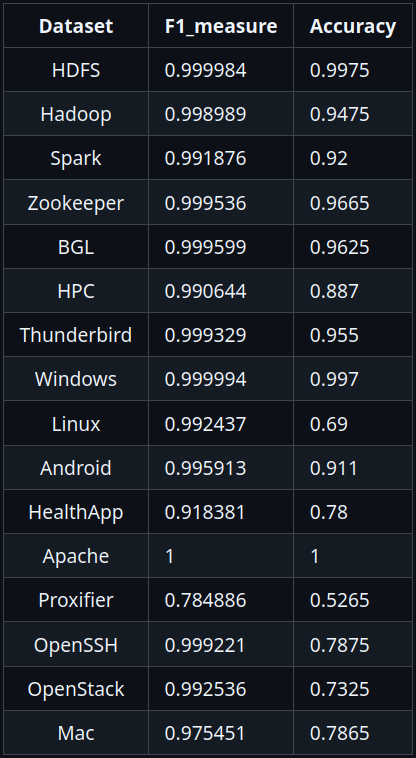

# Log processing pipeline

## Log parsing

- Algorithm used for log parsing (a.k.a. log message template extraction) is [Drain](https://jiemingzhu.github.io/pub/pjhe_icws2017.pdf);

[Benchmarking results](https://github.com/logpai/logparser/tree/main/logparser/Drain#drain):

